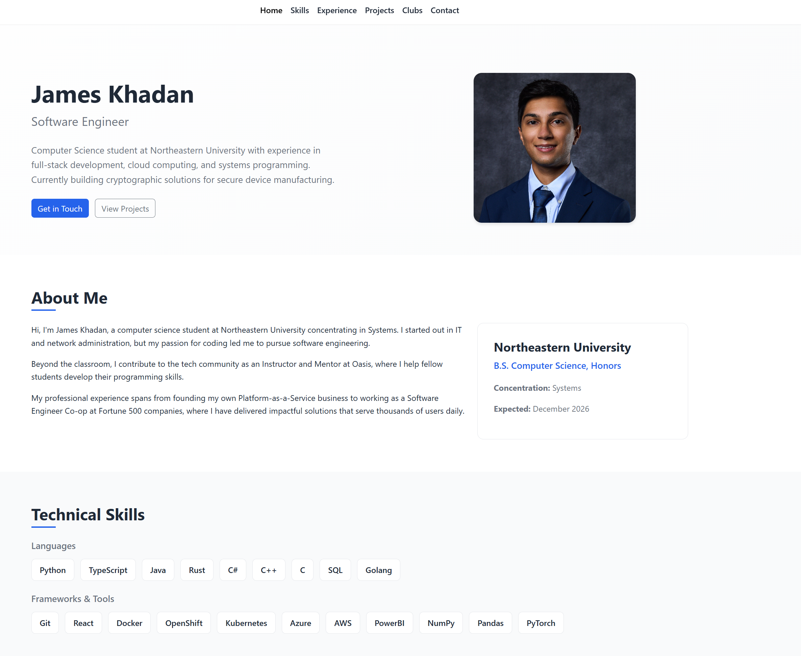

# James Khadan - Personal Homepage

A personal portfolio website built with vanilla HTML5, CSS3, and ES6+ JavaScript for CS 5610 Web Development.

## Author

**James Khadan**
Northeastern University
Email: khadan.j@northeastern.edu

## Class

CS 5610 - Web Development (Graduate)
Northeastern University

## Project Objective

My objective was to create a professional portfolio website that reflects my skills and abilities as a developer using HTML, CSS, and JavaScript.

## Screenshot



## Live Demo

[View Live Site](https://khadanj.github.io/)

## Features

- **Responsive Design:** Mobile-first approach using Bootstrap 5 grid system
- **Professional Hero Section:** Features a professional profile photo with responsive two-column layout
- **Collapsible Experience Cards:** Click on experience entries to expand/collapse detailed descriptions with smooth animations (creative JavaScript feature)
- **Semantic HTML5:** Proper use of header, nav, main, section, article, and footer elements
- **Accessible:** Alt text on images, ARIA labels, keyboard navigation support
- **Clean CSS:** No !important declarations, organized with CSS custom properties

## Pages

1. **index.html** - Main homepage with hero, about, skills, experience, and contact sections
2. **projects.html** - Detailed showcase of software engineering projects
3. **clubs.html** - Showcase of club involvement (AI-generated page)

## Project Structure

```
CS 5610/
├── index.html              # Main homepage
├── projects.html           # Projects page
├── css/
│   └── styles.css          # Custom stylesheet
├── js/
│   └── main.js             # ES6 JavaScript module
├── images/
│   └── profile.jpg         # Professional headshot for hero section
├── docs/
│   └── design-document.md  # Design documentation
├── README.md               # This file
├── package.json            # Project dependencies
├── LICENSE                 # MIT License
├── .eslintrc.json          # ESLint configuration
└── .prettierrc             # Prettier configuration
```

## Getting Started

### Prerequisites

- Node.js (v18 or higher recommended)
- npm

### Installation

1. Clone the repository:

   ```bash
   git clone https://github.com/jkhadan/portfolio.git
   cd portfolio
   ```

2. Install dependencies:
   ```bash
   npm install
   ```

### Running Locally

Open `index.html` directly in a browser, or try the option below:

```bash
python -m http.server 8000
```

### Linting & Formatting

```bash
# Check code style
npm run lint
npm run format:check

# Fix issues automatically
npm run lint:fix
npm run format
```

## Technologies Used

- **HTML5** - Semantic markup
- **CSS3** - Custom properties, Flexbox, Grid
- **JavaScript (ES6+)** - Modules, DOM manipulation
- **Bootstrap 5** - Responsive grid and components
- **Bootstrap Icons** - Icon library

## Validation

- HTML validated with [W3C Validator](https://validator.w3.org/)
- CSS follows best practices
- JavaScript passes ESLint with project configuration

## License

This project is licensed under the MIT License - see the [LICENSE](LICENSE) file for details.

---

## GenAI Usage Documentation

### Tool Used

- Claude (Claude Opus 4.5)
- GitHub Copilot (Auto)

### Prompts Used

"Given my Resume.tex, I need you to add a new page for my club involvement. be sure it matches the same styling as the rest of the website."

"Given the assignment instructions and my resume (for some data on me), use the provided data to help me create design documentation for my website. Be sure to include layout diagrams for each page."

### How Output Was Integrated

- Claude was used to generated the Club Involvement page
- All generated code was reviewed and customized to match personal preferences and information
- GitHub Copilot assisted with development and documentation
- Used design documentation as a starting point, then refined and tested manually

---
